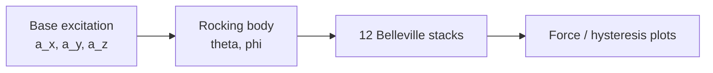

# Background

This page explains the physics behind the [rocking dynamics playground](../validate/playground.html).

## Rocking of an axisymmetric rigid body

A rigid body resting on a set of Belleville washer stacks can rock about a
pivot when the base is excited. The rocking angle $\theta$ and the tipping
point direction $\phi$ describe the motion.

## Equations of motion

The rocking dynamics are governed by

$$
I_{tt} \ddot{\theta} + c\,(1 - s^2)\,\dot{\theta} + \sum_j \tilde{x}_j F_j
= -m h \left( \tau_0' a_x + \tau_1' a_y \right) + m a_z r_0 s
$$

where $s = \operatorname{ssign}(\theta)$ is the smoothed sign of the rocking
angle, $F_j$ is the force in washer stack $j$, and $\tilde{x}_j$ is its
lever-arm position.

## Belleville washer force

Each stack follows the nonlinear Belleville spring law

$$
F(u) = \frac{E\,t\,u}{M a^2}
\left[ (h-u)\left(h - \frac{u}{2}\right) t + t^3 \right]
$$

with hysteresis added by the friction model.

## System layout

## Try it

[Open the playground](../validate/playground.html) to run the simulation
interactively.
