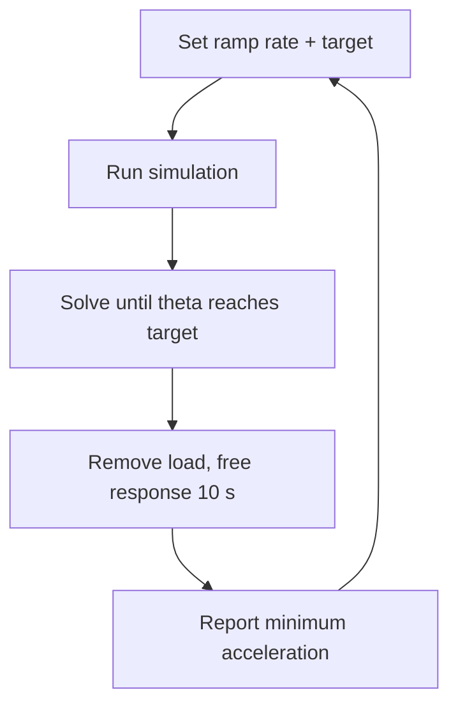

## About this simulator

This tool finds the **minimum base acceleration** needed to rock the rigid
body to a chosen angle. The base acceleration ramps up linearly,

$$
a_x(t) = \text{rate} \cdot t
$$

with $a_y = 0$, so the tipping direction stays $\phi = 0$ (2D side view).
The solve runs until $|\theta|$ first reaches the target angle (or 10 s
elapse); the base acceleration at that moment is the minimum needed to rock
the body that far. Once the target is reached the load is **removed**
($a_x = 0$) and the simulation continues for 10 more seconds to show the
free response.

> **Note:** the load is quasi-static at lower ramp rates.

## Governing equation

The minimum base acceleration to initiate rocking is

$$
{{eq}}
$$

{{defs}}

## Controls

| Control          | Description                                                                                                             |
| ---------------- | ----------------------------------------------------------------------------------------------------------------------- |
| Ramp rate (g/s)  | How fast the base acceleration grows                                                                                    |
| Target θ (deg)   | The rocking angle to reach                                                                                              |
| Disable BW force | Removes the Belleville-washer forces (pure rocking about the pivot); the target then becomes $0.2\,\arctan(r_0/h_{CM})$ |
| Mass / r₀ / h_CM | Body parameters (same as the playground)                                                                                |

> **Note:** since it is a linear model (that works on small angle
> approximation), disabling BW force yields results that are inaccurate at
> higher $\theta$.

## What the plots show

The **Result** tab shows the excitation used by the run, the rocking angle
$\theta$, and the **sum of the 12 Belleville stack forces** $\sum F(t)$ over
time. The animation draws the body at its true angle (no exaggeration), with
a fixed vertical reference line at $x = 0$ so the actual deflection is easy
to compare.

The animation also shows the **inertial force** $m\,a_x$ at the center of
mass as a magenta arrow. Since the base acceleration ramps linearly, the
arrow grows with time — its length and label show $m\,a_x$ in lb. When the
target is reached the load is removed, the arrow disappears, and the body
continues to rock freely for 10 seconds.

The excitation preview marks two key events from the last run:

- **onset** — where rocking first activates (≈ {{a}} g for the current body)
- **target** — where $|\theta|$ reaches the target angle

