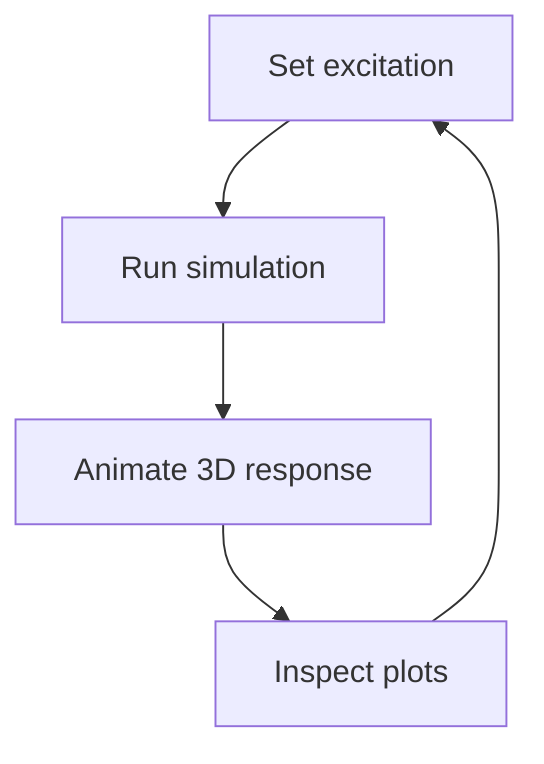

## About this playground

This interactive tool simulates the bidirectional rocking of a rigid body on
12 Belleville washer stacks under base excitation. The animation shows the
body rocking in 3D while the plots track the response.

## Excitation presets

| Preset            | Description                         | Parameters                              |
| ----------------- | ----------------------------------- | --------------------------------------- |
| Sine (continuous) | Steady sinusoidal base acceleration | amplitude, frequency, phase, start time |
| Half-sine train   | Repeated half-sine pulses with rest | amplitude, active, rest, start time     |
| Square wave       | On/off square excitation            | amplitude, on, off, start time          |
| Earthquake        | Recorded time history (CERL)        | aₓ scale, aᵧ scale                      |

## Body parameters

- **Mass** — weight of the body (lb).
- **Pivot radius $r_0$** — radial position of the rocking pivot (in).
- **CM height $h_{CM}$** — height of the center of mass above the base (in).

## What the plots show

The **Displacement** tab shows the rocking angle $\theta$ and the tipping
point direction $\phi$ (in degrees). The **Force** tab shows the Belleville
stack forces and their hysteresis loops for the selected stacks.

